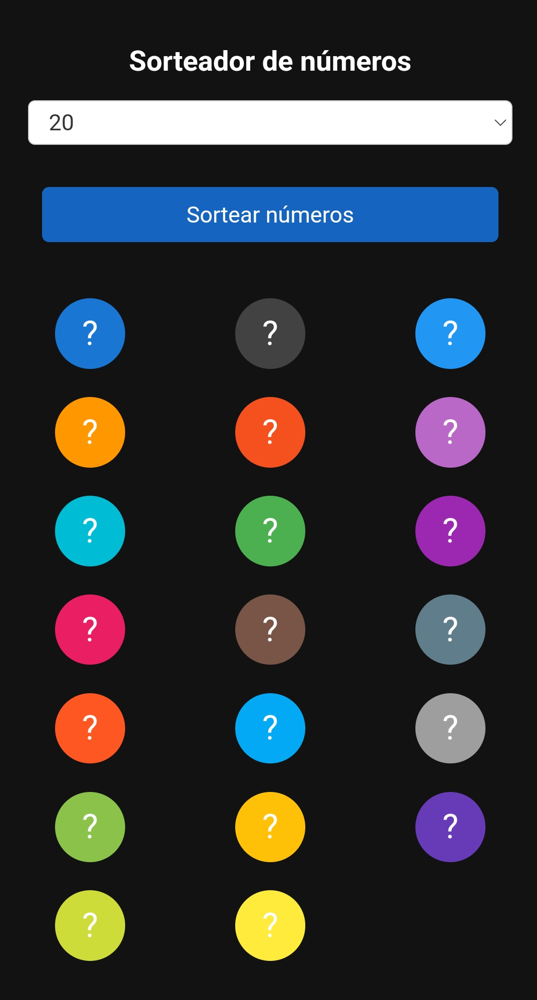

# Site de Sorteio de Números

Este site é uma aplicação web que permite realizar sorteios de números aleatórios que pode ser útil para jogar na megasena caso tenha dúvidas em escolher seus números. :)

Teste agora mesmo [clicando aqui](https://cookieukw.github.io/NumberDrawer/sort.html)

Ele possui as seguintes funcionalidades:

## Funcionalidades

### Sorteio de Números

- O usuário pode clicar no botão "Sortear" para gerar números aleatórios.
- Os números são exibidos em círculos na tela.

### Seleção do Número de Sorteios

- O usuário pode selecionar o número de sorteios desejado em um menu dropdown.
- O número de sorteios padrão é 6, mas pode ser ajustado pelo usuário.

## Como Usar

1. Abra o site em seu navegador.
2. Selecione o número de sorteios desejado no menu dropdown.
3. Clique no botão "Sortear" para iniciar o sorteio.
4. Aguarde até que os números sejam sorteados e os resultados sejam exibidos.

## Veja algumas imagens:

## Tecnologias Utilizadas

- HTML
- CSS
- JavaScript

## Próximas Etapas

- Implementar uma animação mais suave para os sorteios.
- Adicionar a opção de compartilhar os resultados nas redes sociais.
- Função de exportar os números em um arquivo .json

## Contribuição

Contribuições são bem-vindas! Se você deseja contribuir para o desenvolvimento deste site, sinta-se à vontade para enviar pull requests ou abrir issues.

## Licença

Este projeto está licenciado sob a [Licença MIT](LICENSE).